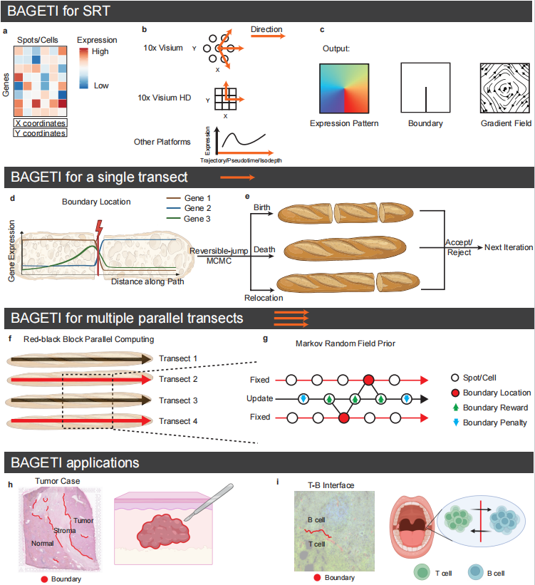

# BAGETI

BAGETI is an Bayesian framework designed to precisely delineate biological boundaries and boundary-aware trajectory within complex tissue architectures. By elevating boundary modeling as a primary objective , BAGETI fills the critical methodological gap between rigid, fully discrete spatial domain partitioning and overly smooth continuous assumptions. The framework integrates a zero-inflated negative binomial model with Markov random field priors to achieve robust, high-resolution segmentation across diverse platform architectures, including 10x Visium and lattice-based SRT. From identifying prognostic spatial signatures in tumor boundaries to providing a physically consistent characterization of directional cellular movements during wound healing , BAGETI transforms noisy transcriptomic signals into interpretable maps of biological interfaces and niche specifications.



## Environment & Requirements

BAGETI requires **R (>= 4.3.0)** along with a C++ compiler toolchain and associated R packages. 

We recommend managing the environment via Conda. All required dependencies and version constraints are specified in [`environment.yml`](./environment.yml).

### Setup via Conda

```bash
# Clone the repository
git clone [https://github.com/](https://github.com/)<username>/BAGETI.git
cd BAGETI

# Create and activate the conda environment
conda env create -f environment.yml
conda activate bageti

# (Optional) Launch JupyterLab to run notebooks
jupyter lab
